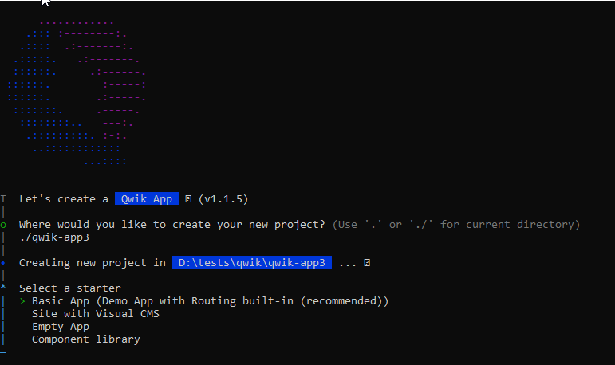
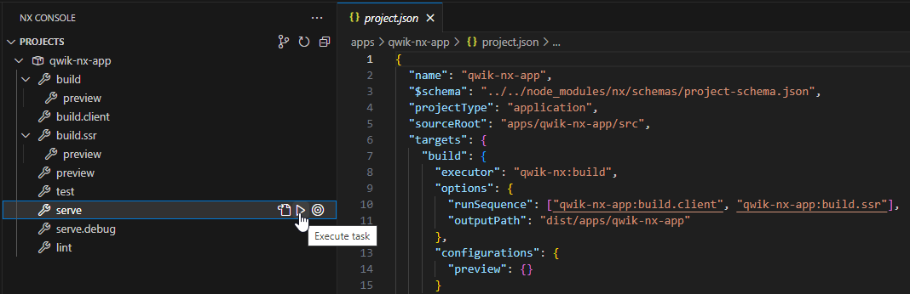
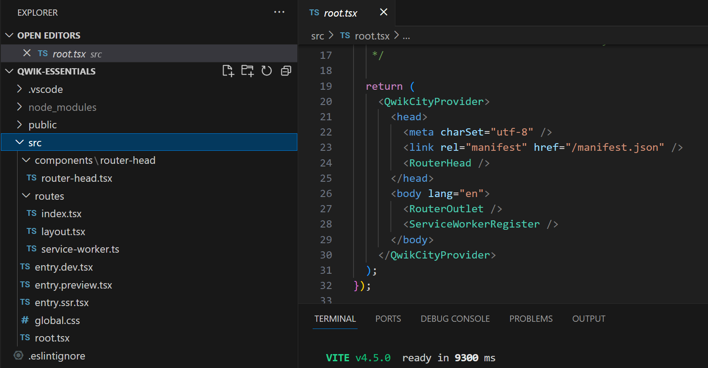

import Tabs from "@theme/Tabs";
import TabItem from "@theme/TabItem";

# Install dependencies and create the project

You have as we write this tutorial, two ways to create a new project with Qwik :

- Using npm create command
- Using Nx and the qwik-nx plugin

## Using npm create command

The easiest way to create a new project is to use the npm create command. This command will create a new project with the latest version of Qwik and all the dependencies needed to run it.

```bash
npm create qwik@latest
```

You will be prompted with options to choose from :



We might want to create an `Empty App` for this tutorial.


## Using Nx and the qwik-nx plugin

If you are using Nx, you can use the qwik-nx plugin to create a new project.
This plugin will create a new Nx workspace with the latest version of Qwik and all the dependencies needed to run it.
You can find the project here : https://github.com/qwikifiers/qwik-nx

```bash
npx create-nx-workspace@latest my-workspace --preset=qwik-nx
```

## Run the application

### Development server
Depending on your install, you have the following options

<Tabs
  defaultValue="create"
  values={[
    { label: "With npm create", value: "create" },
    { label: "With Qwik Nx", value: "nx" },
  ]}>
<TabItem value="create">

```bash
npm start
yarn start
pnpm start
```

</TabItem>
<TabItem value="nx">

The commands are handled by Nx, and can be found in the `apps/my-app/project.json` file.

```bash
  nx run my-app:serve
```

With the correct plugin installed in your IDE, you can run the commands in GUI.
- Plugin for VSCode : https://marketplace.visualstudio.com/items?itemName=nrwl.angular-console
- Plugin for Intellij IDEA : https://plugins.jetbrains.com/plugin/15101-nx-console-idea



</TabItem>
</Tabs>

### Build the application for production
<Tabs
  defaultValue="create"
  values={[
    { label: "With npm create", value: "create" },
    { label: "With Qwik Nx", value: "nx" },
  ]}>
<TabItem value="create">

```bash
npm preview
yarn preview
pnpm preview
```

</TabItem>
<TabItem value="nx">

```bash
  nx run my-app:preview
```

</TabItem>
</Tabs>


### The application structure

Depending on the choice you made, you will have a different structure for your application.
We will start from the empty application and add our components.



We choose a basic application with the QwikCity library pre installed.
We will discuss this topic later.