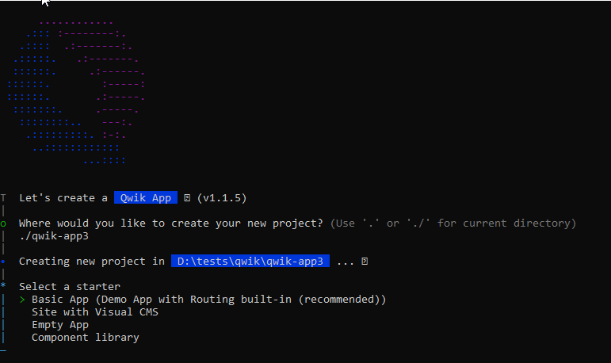

import Tabs from "@theme/Tabs";
import TabItem from "@theme/TabItem";

# Chapitre 2 - Getting started : Installer les dépendances et créer un projet

Au moment où l'on écrit de tutoriel, il y a deux façons de créer un projet Qwik :

- Utiliser la commande npm create
- Utiliser Nx et le plugin qwik-nx

## Utiliser la commande npm create

La façon la plus simple de créer un nouveau projet est d'utiliser la commande npm create.
Cette commande va créer un nouveau projet avec la dernière version de Qwik et toutes les dépendances nécessaires pour le faire fonctionner.

```bash
npm create qwik@latest
```

You will be prompted with options to choose from :



We might want to create an `Empty App` for this tutorial.


## Using Nx and the qwik-nx plugin

If you are using Nx, you can use the qwik-nx plugin to create a new project.
This plugin will create a new Nx workspace with the latest version of Qwik and all the dependencies needed to run it.
You can find the project here : https://github.com/qwikifiers/qwik-nx

```bash
npx create-nx-workspace@latest my-workspace --preset=qwik-nx
```

## Run the application

Depending on your install, you have the following options

<Tabs
  defaultValue="create"
  values={[
    { label: "With npm create", value: "create" },
    { label: "With Qwik Nx", value: "nx" },
  ]}>
<TabItem value="create">

```bash
npm run start
```

</TabItem>
<TabItem value="nx">

The commands are handled by Nx, and can be found in the `apps/my-app/project.json` file.

```bash
  nx run my-app:serve
```

With the correct plugin installed in your IDE, you can run the commands in GUI.
- Plugin for VSCode : https://marketplace.visualstudio.com/items?itemName=nrwl.angular-console
- Plugin for Intellij IDEA : https://plugins.jetbrains.com/plugin/15101-nx-console-idea


</TabItem>
</Tabs>

### The application structure

Depending on the choice you made, you will have a different structure for your application.

