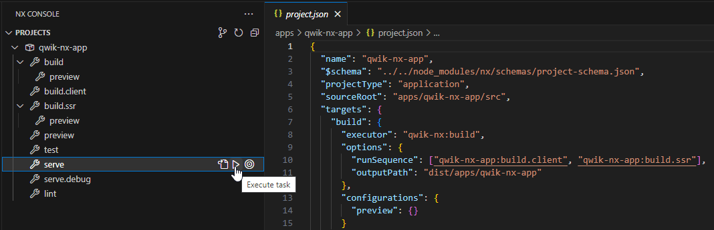

import Tabs from "@theme/Tabs";
import TabItem from "@theme/TabItem";

# Chapitre 2 - Getting started : Installer les dépendances et créer un projet

Au moment où l'on écrit de tutoriel, il y a deux façons de créer un projet Qwik :

- Utiliser la commande npm create
- Utiliser Nx et le plugin qwik-nx

## Utiliser la commande npm create

La façon la plus simple de créer un nouveau projet est d'utiliser la commande npm create.
Cette commande va créer un nouveau projet avec la dernière version de Qwik et toutes les dépendances nécessaires pour le faire fonctionner.

```bash
npm create qwik@latest
```

Vous serez alors invité à choisir le nom de votre projet et le type d'application que vous souhaitez créer. :


Nous vous recommandons de choisir le type d'application "qwik-app" pour ce tutoriel.


## Utiliser Nx et le plugin qwik-nx
Si vous utilisez Nx, vous pouvez utiliser le plugin qwik-nx pour créer un nouveau projet.
Ce plugin va créer un nouveau workspace Nx avec la dernière version de Qwik et toutes les dépendances nécessaires pour le faire fonctionner.
Vous pouvez trouver le projet ici : https://github.com/qwikifiers/qwik-nx

```bash
npx create-nx-workspace@latest my-workspace --preset=qwik-nx
```

## Lancer l'application

### Lancer l'application en mode développement
En fonction du type d'installation que vous avez choisi, vous aurez les options suivantes.

<Tabs
  defaultValue="create"
  values={[
    { label: "With npm create", value: "create" },
    { label: "With Qwik Nx", value: "nx" },
  ]}>
<TabItem value="create">

```bash
npm start
yarn start
pnpm start
```

</TabItem>
<TabItem value="nx">

Les commandes sont gérées par Nx, et peuvent être trouvées dans le fichier `apps/my-app/project.json`.

```bash
  nx run my-app:serve
```

Avec le plugin correctement installé dans votre IDE, vous pouvez exécuter les commandes en GUI.
- Plugin pour VSCode : https://marketplace.visualstudio.com/items?itemName=nrwl.angular-console
- Plugin pour Intellij IDEA : https://plugins.jetbrains.com/plugin/15101-nx-console-idea



</TabItem>
</Tabs>

### Build l'application en mode production
<Tabs
  defaultValue="create"
  values={[
    { label: "With npm create", value: "create" },
    { label: "With Qwik Nx", value: "nx" },
  ]}>
<TabItem value="create">

```bash
npm preview
yarn preview
pnpm preview
```

</TabItem>
<TabItem value="nx">

```bash
  nx run my-app:preview
```

</TabItem>
</Tabs>


### La structure de l'application

En fonction du choix que vous avez fait, vous aurez une structure différente pour votre application.

